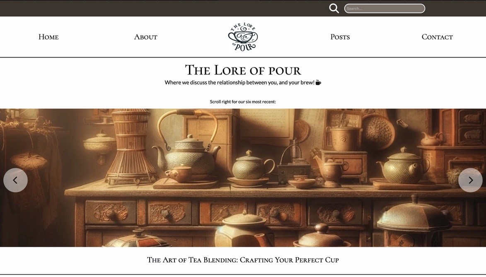
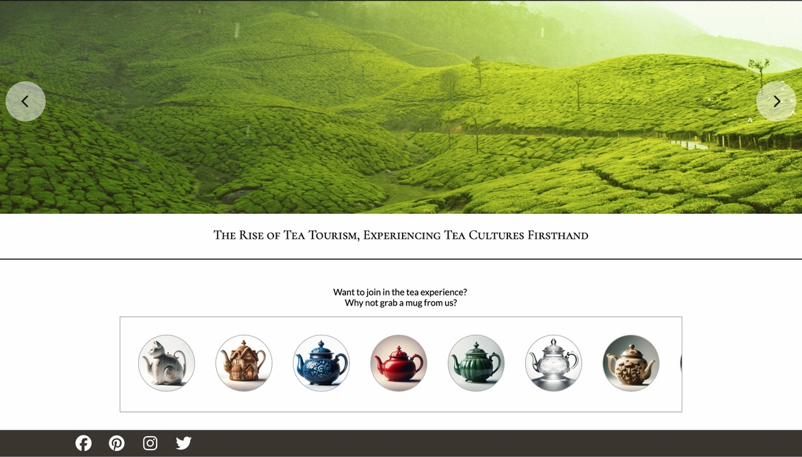

---

  

---

# The Lore of Pour- Project Exam 1 - 

Our final exam of Noroff first year, and perhaps our most extensive use of JavaScript to date.
Our brief was to create a blog site hosted by wordpress, and to fetch the data via an API call. 
The site could be on anything we chose, but had specific pages and functionality that we were required to include- I chose to make a peaceful, sleepy tea blog that also sold teacups to go with the posts on serving and enjoying the perfect brew.

## Site purpose:

The purpose of the site is purely informative and entertaining- all about tea- its history, how England stole it, its cultural, artistic and social significance, how it has shaped countries, literature and the class systems, its many health benefits and how to brew the perfect cup.
On top of this I had planned on adding a shop section so you could buy the perfect cup to go with your edification.

### Description

-- Home Page

The only requirement of the home page was for there to be a carousel so you could see the latest posts on your site.
I kept my design clean but later added the introduction to the shop in the form of a second small carousel. You can click on any link within the carousel and be taken to the corresponding article.

-- Posts

I added a range of blog posts about tea, each is fetched via api and navigated to either from the carousel or the posts page. 
Images and relevent text for each are displayed.

-- All Posts Page

Where you can see all of the posts available on the site- the specification for this page was that there needed to be a "see more" button to display more posts after only around ten were initially displayed- I also added a "See less" button.

-- Contact Page

Contact information with required form validation to proceed.

#### Getting Started

** Installing **

Clone the repo:
git clone git@github.com: https://github.com/AutopsyTurvy/The-Lore-of-Pour--Project-Exam-1.git

** Install the dependencies: **

Enable CORS for access

npm install

** Running **

To run the app, run the following commands:

npm run start

** Contributing **

Contributions are welcome, but I would request that the invidicual that does so, clones the code and adds notes so that I can review any changes before they are comitted to the project permanently. Thank you! 

** Contact **

This is where you can leave your social links for people to contact you, such as a LinkedIn profile or Twitter link e.g.

** Email me: **

autopsyturvycoding@gmail.com

** Acknowledgments: **

Thanks to my dear friend Jamie, that went through information on API calls with me, and taught me how to filter through objects and arrays.

